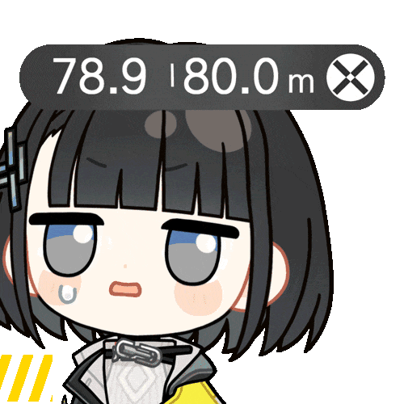
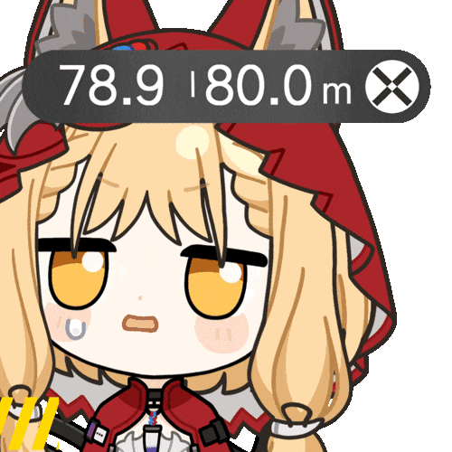
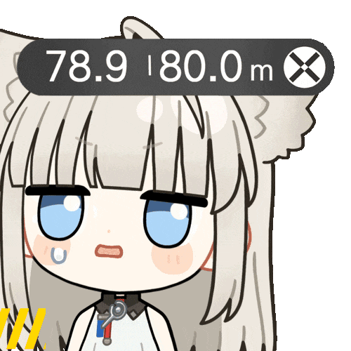
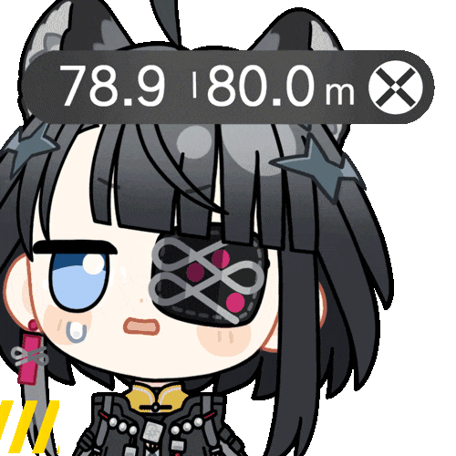
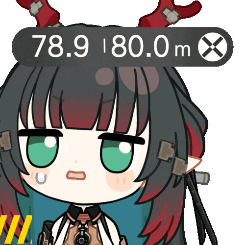

# 自动化综述撰写&置信度评估系统

[Python](https://www.python.org/)


<table width="100%" cellpadding="0" cellspacing="0" style="table-layout: fixed; border-collapse: collapse; border-spacing: 0; margin: 0.5em 0;">
  <tr>
    <td align="center" width="20%" style="padding: 0;"></td>
    <td align="center" width="20%" style="padding: 0;"></td>
    <td align="center" width="20%" style="padding: 0;"></td>
    <td align="center" width="20%" style="padding: 0;"></td>
    <td align="center" width="20%" style="padding: 0;"></td>
  </tr>
</table>

<table width="100%" cellpadding="0" cellspacing="0" style="table-layout: fixed; border-collapse: collapse; border-spacing: 0; margin: 0.5em 0;">
  <tr>
    <td align="center" width="10%" style="padding: 0;"></td>
    <td align="center" width="10%" style="padding: 0;"></td>
    <td align="center" width="10%" style="padding: 0;"></td>
    <td align="center" width="10%" style="padding: 0;"></td>
    <td align="center" width="10%" style="padding: 0;"></td>
    <td align="center" width="10%" style="padding: 0;"></td>
    <td align="center" width="10%" style="padding: 0;"></td>
    <td align="center" width="10%" style="padding: 0;"></td>
    <td align="center" width="10%" style="padding: 0;"></td>
    <td align="center" width="10%" style="padding: 0;"></td>
  </tr>
</table>

<table width="100%" cellpadding="0" cellspacing="0" style="table-layout: fixed; border-collapse: collapse; border-spacing: 0; margin: 0.5em 0;">
  <tr>
    <td align="center" width="10%" style="padding: 0;"></td>
    <td align="center" width="10%" style="padding: 0;"></td>
    <td align="center" width="10%" style="padding: 0;"></td>
    <td align="center" width="10%" style="padding: 0;"></td>
    <td align="center" width="10%" style="padding: 0;"></td>
    <td align="center" width="10%" style="padding: 0;"></td>
    <td align="center" width="10%" style="padding: 0;"></td>
    <td align="center" width="10%" style="padding: 0;"></td>
    <td align="center" width="10%" style="padding: 0;"></td>
    <td align="center" width="10%" style="padding: 0;"></td>
  </tr>
</table>

<table width="100%" cellpadding="0" cellspacing="0" style="table-layout: fixed; border-collapse: collapse; border-spacing: 0; margin: 0.5em 0;">
  <tr>
    <td align="center" width="10%" style="padding: 0;"></td>
    <td align="center" width="10%" style="padding: 0;"></td>
    <td align="center" width="10%" style="padding: 0;"></td>
    <td align="center" width="10%" style="padding: 0;"></td>
    <td align="center" width="10%" style="padding: 0;"></td>
    <td align="center" width="10%" style="padding: 0;"></td>
    <td align="center" width="10%" style="padding: 0;"></td>
    <td align="center" width="10%" style="padding: 0;"></td>
    <td align="center" width="10%" style="padding: 0;"></td>
    <td align="center" width="10%" style="padding: 0;"></td>
  </tr>
</table>

<table width="100%" cellpadding="0" cellspacing="0" style="table-layout: fixed; border-collapse: collapse; border-spacing: 0; margin: 0.5em 0;">
  <tr>
    <td align="center" width="10%" style="padding: 0;"></td>
    <td align="center" width="10%" style="padding: 0;"></td>
    <td align="center" width="10%" style="padding: 0;"></td>
    <td align="center" width="10%" style="padding: 0;"></td>
    <td align="center" width="10%" style="padding: 0;"></td>
    <td align="center" width="10%" style="padding: 0;"></td>
    <td align="center" width="10%" style="padding: 0;"></td>
    <td align="center" width="10%" style="padding: 0;"></td>
    <td align="center" width="10%" style="padding: 0;"></td>
    <td align="center" width="10%" style="padding: 0;"></td>
  </tr>
</table>

<table width="100%" cellpadding="0" cellspacing="0" style="table-layout: fixed; border-collapse: collapse; border-spacing: 0; margin: 0.5em 0;">
  <tr>
    <td align="center" width="10%" style="padding: 0;"></td>
    <td align="center" width="10%" style="padding: 0;"></td>
    <td align="center" width="10%" style="padding: 0;"></td>
    <td align="center" width="10%" style="padding: 0;"></td>
    <td align="center" width="10%" style="padding: 0;"></td>
    <td align="center" width="10%" style="padding: 0;"></td>
    <td align="center" width="10%" style="padding: 0;"></td>
    <td align="center" width="10%" style="padding: 0;"></td>
    <td align="center" width="10%" style="padding: 0;"></td>
    <td align="center" width="10%" style="padding: 0;"></td>
  </tr>
</table>

> [!WARNING]
> 我真求你了文献归根结底要**自己看**，不要盲目相信本项目！

首先，这是一个sb工作。是我拿另一个工作随便改改的课程作业，所以很粗糙，但是我自己和我朋友用大概是足够了的。

我个人认为有一些优点，但是可优化的点太多了，多到数不清，本人给到一个拉完了，而且it's not my professional field，真的懒得弄了。

作用是：如果我作为一个某领域的初学者，我或许可以通过这个工作来自动生成一篇综述，顺便帮你搜一下相关文献。

冷知识，其实它对pubmed的适配比arxiv和IEEE好很多。（反正我朋友说很夯，准确度方面甚至有些超过了市面上的大部分同类型工具。但是，额，本工作没有创新点啊。）

然后这个代码充斥着大量的agent痕迹，因为本人又菜又懒。

还有一件事，api请自备。

最后，如果你有优化建议，欢迎issues（回不回是另一回事喵）。

另外，我觉得本项目的贡献可能还没有收集开头那个表情包的贡献大。感谢表情包来源  [**春也Haruya**](https://space.bilibili.com/3280)。表情包夯爆了老师画的太可爱了简直就是神中神啊画一辈子表情包吧诶一休尼？

下面是agent帮我写的套话喵~

## 项目简介

本系统是一个智能化的学术研究辅助工具，能够针对任意研究主题自动检索论文、抓取信息、进行交叉比对与综合总结，并通过置信度评估机制，输出可信的研究综述报告。

## 快速开始

### 环境要求

- Python 3.8 或更高版本
- 网络连接（用于访问学术数据库和AI API）

### 安装步骤

1. **安装依赖**

```bash
pip install -r requirements.txt
```

2. **配置API密钥**

在 `config/config.yaml` 填入你的 API 密钥与 PubMed 联系邮箱：

**API密钥获取地址：**

- DeepSeek: [https://platform.deepseek.com/](https://platform.deepseek.com/)
- Kimi (Moonshot AI): [https://platform.moonshot.cn/](https://platform.moonshot.cn/)

3. **启动Web应用（推荐）**

```bash
python app.py
```

浏览器会自动打开 `http://localhost:5000`，如果未自动打开，请手动访问该地址。

4. **命令行版本（可选，但不推荐喵）**
  实现位于 `src/cli_main.py`，根目录 `main.py` 仅作入口。流程与 Web 不完全相同（CLI 仍包含传统一致性/术语等管线）。日常使用建议仍以 Web 为主：

```bash
python main.py
```

## 功能说明

### 1. 论文源

- [arXiv](https://arxiv.org/)
- [IEEE Xplore](https://ieeexplore.ieee.org/)
- [PubMed](https://pubmed.ncbi.nlm.nih.gov/)

**检索特性：**

- AI关键词扩展：自动生成英文关键词提高检索精度
- 年份过滤：支持设置起始和结束年份
- 排序方式：支持按相关性、日期等排序
- 全文获取：部分来源支持获取论文全文（需在配置中启用）

### 2. PDF上传与分析

- **PDF上传**：支持上传本地PDF文件，自动解析论文信息（最大100MB）。
- **PDF联想分析**：提取PDF全文内容，使用AI识别重点引用文献（可设置数量），生成拓展关键词（基于PDF内容分析），使用拓展关键词搜索相关论文。

### 3. AI分析功能

**支持的分析模型：**

- DeepSeek Chat / DeepSeek Reasoner
- Kimi (Moonshot AI) 8K/32K/128K

### 4. 置信度评估

系统基于LLM自评机制评估分析结果的可信度：

- **LLM自评置信度**：AI模型基于客观依据（支持论文数量、文献覆盖情况等）对自身分析结果进行置信度评估
- **冲突检测**：自动识别论文之间的观点冲突，并列出具体冲突点
- **置信度理由**：提供详细的置信度评估理由，包括支持主要结论的论文数量和编号、关键问题的文献覆盖情况、冲突程度等信息

### 5. 报告生成

系统自动生成多种格式的研究报告：

- **HTML报告**：美观的网页格式，支持在浏览器中查看，**已嵌入交互式主题图谱和子话题推荐**
- **Markdown报告**：结构化的Markdown文档
- **PDF报告**：格式化的PDF文档（需要reportlab，支持中文）
- **BibTeX文件**：导出为BibTeX格式，方便导入到Zotero、Mendeley、LaTeX等引用管理工具
- **时间轴**：展示论文发表时间线
- **词云图**：基于关键词生成词云图，直观展示研究热点（需要wordcloud库）
- **推荐关键词**：分析完成后自动生成5个推荐搜索关键词，便于进一步深入研究
- **问答**：基于生成的综述报告，支持智能问答
